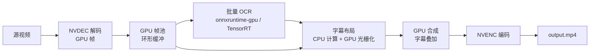

# 原生 GPU 视频处理管线设计（GPU-Native Pipeline）

> 本文是一份**前瞻性技术设计**：把「视频日语字幕翻译」管线（CFR → OCR → 渲染）从当前「多核 CPU + 硬件编解码辅助」架构，演进为**帧数据全程驻留 GPU、逐阶段异步流水化**的原生 GPU 架构。
> 当前**不落地**，仅存档设计思路，供未来管线吞吐成为瓶颈时参考。

---

## 1. 背景与动机

### 1.1 现状（实测数据）
- 渲染（画字幕 + NVENC）：~45~58 帧/秒，**CPU 画字是瓶颈**；
- OCR（抽帧 + 小模型识别）：GPU 利用率 **0~30%**，瓶颈在 CPU 取帧/预处理；
- 实例出口上传：~4.5MB/s，网络瓶颈（与 GPU 无关，本文不讨论）；
- 结论：当前架构下 **GPU 算力大量闲置，CPU 与帧取送路径是真正的短板**。

### 1.2 本设计的目标
1. **帧数据零 CPU 拷贝**：从解码到编码全程留在显存；
2. **OCR 批量推理**：把逐帧串行推理改为一批帧一次推理，吃满 GPU 吞吐；
3. **多级异步流水线**：解码/OCR/绘制/编码四阶段重叠执行，消除串行等待；
4. **与现有 CPU 路径共存**：配置开关切换，CPU 路径作为回退兜底。

### 1.3 何时值得启用
- 单批处理视频数量大（>10 个）、单视频长（>10 分钟）；
- 渲染/OCR 成为批次吞吐瓶颈，且 CPU 核数已无法继续线性扩展；
- 有 NVIDIA 显卡且显存 ≥8GB、带宽充裕。

---

## 2. 总体架构



- 四阶段各跑一个（或一组）worker，级间用**有界队列**连接；
- 帧数据在显存内流转，**只在**布局结果（坐标/文本）、最终文件写入处与 CPU 交互；
- 全链路**单进程**即可（避免多进程间显存拷贝），用线程 + 队列做异步。

---

## 3. 分阶段设计

### 3.1 解码：NVDEC
- 用 `ffmpeg -hwaccel cuda -hwaccel_output_format cuda`（或 PyAV + CUVID/NvPipe），解码帧直接输出为 **CUDA 张量**（NV12/BGR）；
- 关键：**禁止** `nv12 → CPU → GPU` 的回拷；后续 OCR/绘制都在显存内操作；
- CFR 前置：本管线本身按 CFR 工作，源 VFR 先用 NVDEC+NVENC 过一遍转恒定帧率（一次性、快）。

### 3.2 帧池与显存预算
- 显存中维护**帧池**（如 8~16 帧槽）复用，避免每帧重新分配；
- 以 `2520×1080×3` 为例单帧 ~8MB，16 帧池 ~128MB，显存压力可忽略；
- 剩余显存全部分给 OCR 批处理与绘制中间缓冲；设置硬预算，超限时降 batch 或阻塞。

### 3.3 OCR：批量推理（核心增益点）
- **批处理**：每批攒 N 帧（如 4~16 帧）的台词区 crop，拼成 batch 一次性推理 det + rec；
- 预处理（缩放、归一化、pad）用 CUDA 算子（PyTorch tensor / onnxruntime 的 preprocess），**不在 CPU 做**；
- 动态 batch / 动态分辨率：用 onnxruntime 的 `dynamic_axes` 或 TensorRT engine 固定几档分辨率；
- 输出：检测框、识别文本 + 置信度，回填到帧级元数据；
- 预期收益：单卡吞吐从逐帧 ~70ms/帧 提升到批量 ~10~20ms/帧（数倍），且让 GPU 利用率显著上升。

### 3.4 字幕布局：CPU 算布局，GPU 光栅化
- **CPU 负责**：把 segments + translations 按时间轴切到帧、计算字幕条带的坐标/字号/居中偏移、换行——这是低频、逻辑密集部分；
- **GPU 负责**：把文本**光栅化**成带 alpha 的纹理（位图字体 atlas 或 GPU 端字形渲染）；
- CJK 字体：预生成常用汉字/假名的**字形 atlas**（Texture Atlas），运行时查表拼字，避免 GPU 上逐字矢量光栅化；
- 描边/阴影/抗锯齿：在光栅化阶段用 SDF（Signed Distance Field）或膨胀 alpha 实现，GPU 上开销很小。

### 3.5 字幕绘制：GPU 合成
- 每帧：把字幕纹理按布局贴到帧的条带区域，做 alpha 合成；
- 实现方式（二选一）：
  1. **CUDA kernel**：逐像素混合（简单、可控）；
  2. **CUDA + 纹理采样**：把帧与字幕纹理作为 CUDA array，用纹理单元做双线性合成；
- 条带底色 `auto`：沿用现有"取台词框内暖灰均值"逻辑，均值计算也在 GPU 上做（reduce）。

### 3.6 编码：NVENC
- `ffmpeg -c:v h264_nvenc`（或 NVENC SDK 直接编码），输入为显存中的合成帧；
- 与解码对称，全程显存内完成，最终输出文件经 CPU 写盘；
- 多路并发编码时注意消费级显卡 NVENC 会话上限（约 3~5 路）。

---

## 4. 异步调度

```
[解码线程] --queue-> [OCR线程] --queue-> [合成线程] --queue-> [编码线程]
```

- 每级一个**有界队列**（容量 = 帧池大小），水位满则上游阻塞（背压），防止显存/内存爆炸；
- **帧序保证**：帧在管线中带序号，OCR/绘制结果按序回填，编码严格按序；
- **重叠收益**：解码 1 帧、OCR 1 批、合成 1 帧、编码 1 帧可同时进行，总吞吐由**最慢级**决定，而不是各阶段之和；
- 字幕时间轴：渲染只对**有字幕变化的帧**做合成（diff 优化），无变化帧直接透传解码结果给编码器，大幅省合成算力。

---

## 5. 技术选型

| 方案 | 优点 | 缺点 | 适用 |
|---|---|---|---|
| **A. Python + PyTorch/onnxruntime-gpu + PyAV + numba/CUDA** | 与现有代码同语言、开发快、模型生态好 | 异步/内存管理略糙、显存控制需小心 | 快速原型、小规模批处理 |
| **B. C++ + CUDA/CUDART + NvPipe/NVENC SDK + TensorRT** | 性能上限最高、显存可控 | 开发量大、维护成本高 | 生产级、大规模长期运行 |
| **C. 混合：Python 编排 + C++/CUDA 扩展（pybind11）** | 平衡开发与性能 | 需要桥接层 | 推荐主路径 |

- 建议**方案 C**：Python 管编排/字幕逻辑（沿用现有 segments/translations 逻辑），热点（帧合成、批预处理）用 CUDA 扩展；
- OCR 推理引擎优先 **onnxruntime-gpu**（现有模型直接复用），吞吐不满足再上 TensorRT。

---

## 6. 关键难点与对策

| 难点 | 对策 |
|---|---|
| 显存带宽/PCIe 成为新瓶颈 | 全程零拷贝（CUDA 内存池 + 显存内流转）；避免 CPU 镜像 |
| CJK 文本 GPU 光栅化 | 预生成字形 atlas + SDF 描边；运行时只拼贴 |
| 动态 batch / 变长文本 | onnxruntime `dynamic_axes` 或 TensorRT 多档 engine；按长度分组 batch |
| 与现有 CPU 路径共存 | `config.yaml` 增加 `pipeline.backend: gpu|cpu`，两套后端共用同一 segment/translation 数据与命令入口 |
| 多进程 ↔ 显存 | 单进程多线程模型；若必须多进程，用 CUDA IPC 共享显存 |
| NVENC 并发上限 | 批内合并编码会话；或限制并行渲染路数 ≤2 |

---

## 7. 预估收益与适用边界

- **预期吞吐**：OCR 批量后单卡识别提速 3~5×；合成 diff 优化后渲染接近解码/编码硬件速度（数百帧/秒）；整体批次耗时预计**下降 50%~70%**；
- **适用边界**：
  - 单机多卡可进一步按视频切分并行；
  - 显存 <8GB 时批量受限，优先保证 OCR batch ≥4；
  - 网络上传（~4.5MB/s）仍是批次总耗时的下限，GPU 提速无法消除；
- **风险**：工程量大（建议按"解码→OCR→合成→编码"四步分阶段落地，每步可独立验证与回退）。

---

## 8. 分阶段迁移路径（未来启用时）

1. **P0 解码/编码显存化**：NVDEC/NVENC 替换 OpenCV 读帧与写入，帧池 + 零拷贝（先不动 OCR/绘制）——验证显存流转；
2. **P1 OCR 批量**：抽帧在显存内批量推理，保留 CPU 兜底开关——单点收益最大；
3. **P2 合成 GPU 化**：字形 atlas + CUDA 合成，diff 优化；
4. **P3 全异步流水线**：四阶段队列化，统一 `pipeline.backend` 配置；
5. 每阶段与 CPU 路径做**同批结果比对**（segments/translations/output 一致性），确保可回退。

---

## 附：与本文配套的现状结论（存档）

- 当前"多核 CPU + 硬件编解码 + 轻量 OCR 推理"的架构**不必改动**，配置方向维持（GPU 配置用于实例、CPU 默认用于仓库）；
- 本文是**未来吞吐瓶颈时的升级蓝图**，不是当前待办。
